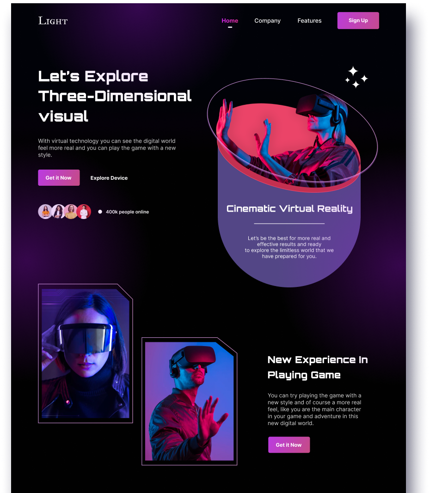

# 📗 Table of Contents

- [📖 About the Project](#about-project)
  - [🛠 Built With](#built-with)
    - [Libraries Frameworks](#libraries-frameworks)
    - [Key Features](#key-features)
  - [🚀 Live Demo](#live-demo)
- [💻 Getting Started](#getting-started)
- [Setup](#setup)
  - [Prerequisites](#prerequisites)
  - [Install](#install)
  - [Usage](#usage)
- [👥 Author](#author)

- [🤝 Contributing](#contributing)

- [⭐️ Show your support](#support)
 
- [🙏 Acknowledgements](#acknowledgements)
- [📝 License](#license)


# 📖  React project - VR Landing Page <a name="about-project"></a>

**VR Landing Page**  An immersive VR landing page experience that introduces users to the world of virtual reality. Through stunning visuals, interactive elements, and engaging content, the landing page will showcase the latest VR technology, highlight its applications across various industries.


## 🛠 Built With <a name="built-with"></a>
- React: JavaScript library for building the user interface components and managing the application state.
 
## 🛠 Libraries & Frameworks
<ul>

  <li><a href="https://tailwindcss.com/">Tailwind CSS (All Styling)</a> This framework is vital for my development workflow, streamlining style application and ensuring the website's design aligns with the Figma mockups efficiently. Its utility-first approach greatly accelerated the development, facilitating responsive and aesthetically pleasing layouts with ease.</li>
  <li><a href="https://react-icons.github.io/react-icons/">React Icons (All displayed icons)</a> This is one of my "essential" libraries for developing, allows to integrate Icons in a very easy and customizable way</li>
  <li><a href="https://www.npmjs.com/package/react-modal-video">React-modal-video
</a> This package is a React component library that provides a simple way to implement modal videos in a React application</li>
  <li><a href="https://michalsnik.github.io/aos/">AOS (Animate on scroll)</a> This library allowed me to generate some of the animations that are being executed while the app is scrolled. </li>
  <li><a href="https://swiperjs.com/">Swiper (Infinite Carousel)</a> This is another essential library, it allowed me to create the infinite carrousel as shown on the figma display</li>
</ul>

### Key Features <a name="key-features"></a>
- **Responsiveness** Application is rigorously tested across a spectrum of viewports to ensure flawless responsiveness and exceptional adaptability!
- **Animations** Animated the user experience with dynamic animations that enhance interactivity and visual appeal, seamlessly integrated for smooth, captivating transitions.
- **Attetion to Detail** Despite the absence of some requirements, I implemented data mockups, high-quality images, and all kinds of resources showcasing my dedication to paying attention to minor details. 
- **Coding Practices** Adhered to industry-leading coding standards, ensuring clean, maintainable, and efficient code across  project. 
- **GitFlow** I used Gitflow to keep the code versions smooth and organized.
## 🚀 Live Demo <a name="live-demo"></a>
[ Live Demo Link](#URL)
## 💻 Getting Started

To get this project to run on your machine you need to follow some easy steps

### Prerequisites

In order to run this project you need:

```sh
 To have a computer, Internet, Keyboard, and Mouse
```

### Setup

Clone this repository to your desired folder:

```sh
  Open it with Visual Studio Code (or your preferred IDE), and open a console on the respective folder of the project that you want to check.
```

### Install

Install this project with:

```sh
  Additional installations are not necessary, just run ``npm install ``
```

### Usage

To run each project, execute the following command (_remember, you must be inside a respective folder "**vr-landing-page**  of the project inside the terminal_):

```sh
npm start
```
To run the project, execute the following command:

 run npm start command 

## 👥 Author <a name="getting-started"></a>

👤 **Binod Bhusal**
- GitHub: [@githubhandle](https://github.com/binodbhusal)
- Twitter: [@twitterhandle](https://twitter.com/Binod_ironLad)
- LinkedIn: [LinkedIn](https://www.linkedin.com/in/binodbhusal) 

## 🤝 Contributing <a name="contributing"></a>

Contributions, issues, and feature requests are welcome!

Feel free to check the [issues page](https://github.com/binodbhusal/vr-landing-page/issues).

## ⭐️ Show your support <a name="support"></a>

If you like this project just give it a star ⭐️ .

Everybody is welcome to suggest changes.

In order to do it, fork this repository, create a new branch and open a Pull Request from your branch

## 🙏 Acknowledgments <a name="acknowledgements"></a>
I would like to thanks 
[Nickelfox Design](https://www.figma.com/community/file/1100751527569288223/virtual-reality-landing-page-concept) for the website design system that inspired my design.
## 📝 License <a name="license"></a>

This project is [MIT](./LICENSE.md) licensed.
